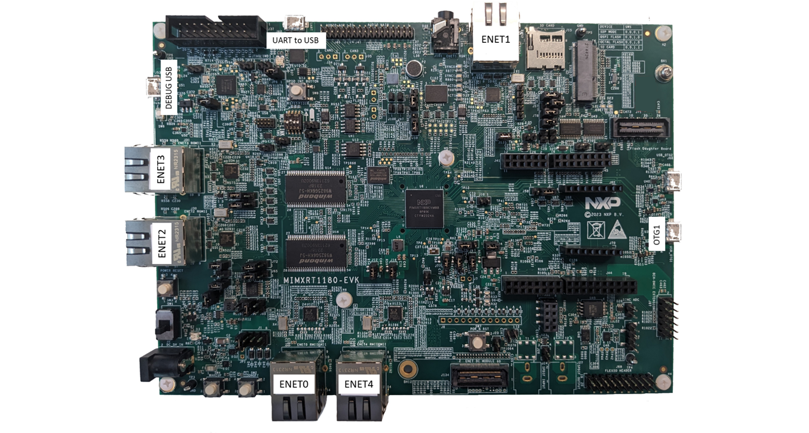

# Evaluation boards description and supported roles

The GenAVB/TSN stack is supported on the i.MX RT1180 SoC and evaluation boards that differ in capabilities. Also, the connections needed for the various use cases may differ depending on the available ports. This section provides an overall description of the different evaluation boards and their available hardware ports and connections.

The following sections in the document refer to the i.MX evaluation boards depending on their role:

- **i.MX RT TSN Endpoint:** A board that can send and receive packets complying to TSN requirements and terminating the network protocols.

- **i.MX RT TSN Bridge:** A board that can send and receive packets complying to TSN requirements over several ports and bridging the network protocols.

Each supported evaluation board can be used in a set of these roles. Please refer to each board’s description to make sure that your board can be used for the desired use case.

## i.MX RT1180 EVK board

This evaluation board can support the following roles in the TSN evaluation use cases described in this document:

- **i.MX RT TSN Bridge**

  - Bridge application runs on Cortex-M33 core

- **i.MX RT TSN Endpoint**

  - Endpoint application runs either on Cortex-M7 or Cortex-M33 core.

Endpoint and Bridge roles may be combined on the same board (possibly even on the same core).

<figure>

<figcaption>
i.MX RT1180 EVK board
</figcaption>
</figure>

For **TSN Bridge** operation, the Ethernet bridge external physical ports are defined as follows:

- ENET0: RMII / 100Mbps

- ENET1: RGMII / 1Gbps

- ENET2: RGMII / 1Gbps

- ENET3: RGMII / 1Gbps

For **TSN Endpoint** operation, the endpoint ports are defined as follows (two possible options, depending on configuration used):

- An internal port connected to the bridge is used. All Endpoint network packets flow through the bridge, between the internal port and one of the physical external ports

  - Internal Endpoint: 1Gbps

- An external physical port

  - ENET4: RMII / 100Mbps
