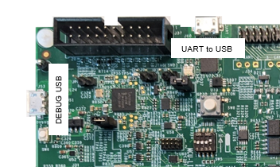

# Serial Terminal

Using any serial terminal emulator (minicom, PuTTy, TeraTerm, …) on a PC connected to the i.MX EVK board gives access to application logs and a simple command shell (see [Using the Built-in Shell](../04_more_on_evaluation_usage/01_using_the_built_in_shell.md#using-the-built-in-shell)).

It is recommended to enable the “Carriage Return after Line Feed” option for getting a readable print out of the logs. The configuration will vary depending on the terminal emulator used. For PuTTy, enable the “Implicit CR in every LF” option of the terminal emulator.

## i.MX RT1180 EVK board

The USB connections expose separate serial communication interfaces for Cortex-M33 and Cortex-M7 cores. Use this serial interface to configure the terminal emulator with serial parameters set to 115200/N/8/1.

For Cortex-M33 serial console: J53, named “Debug USB”

For Cortex-M7 serial console: J60, named “UART to USB”

<figure>

<figcaption>
USB connections for serial terminal in i.MX RT1180 board
</figcaption>
</figure>

