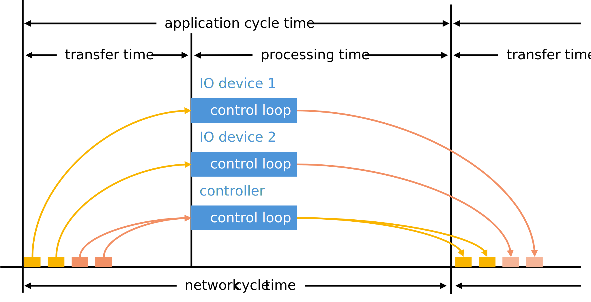
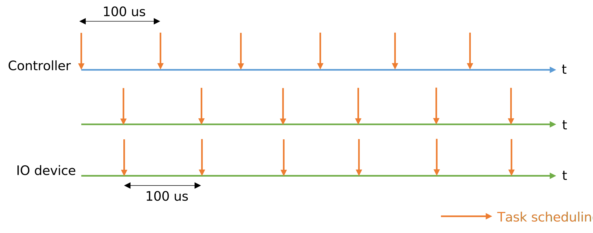

# TSN Isochronous Application

The TSN isochronous application provides example code and re-usable middleware exercising the GenAVB/TSN API.

Key standards used in this TSN example application:

- gPTP (IEEE 802.1AS-2020)

- Enhancements for scheduled traffic (IEEE 802.1Q-2018, section 8.6.8.4)

- Frame Preemption (IEEE 802.3br-2016 and IEEE 802.1Qbu-2016)

<figure>

<figcaption>
TSN application cycle
</figcaption>
</figure>

The TSN example application implements a control loop similar to industrial use cases requiring cyclic isochronous exchanges over the network.

The TSN endpoints run their application synchronized to a common time grid in the same gPTP domain so that they can send and receive network traffic in a cyclic isochronous pattern (the application cycle time is equal and synchronous to the network cycle time as shown in above figure). Currently, the cycle is configured with a period of 100μs. When the application is scheduled, frames from other endpoints are ready to be read and processed. At the end of the application processing cycle, frames are queued to be sent to other endpoints.

<figure>

<figcaption>
TSN application scheduling
</figcaption>
</figure>

As shown, the controller and the IO devices can be scheduled with a half cycle offset in order to reduce the processing latency.

The time sensitive traffic is layer 2 multicast with VLAN header and proprietary EtherType. Its priority is defined using the PCP field of the VLAN header.

On transmit, Enhanced Scheduled Traffic is used to send the time sensitive traffic at a precise time (application scheduling time + 35μs) and to make sure there is no interference from best effort traffic[^1].

In addition, the TSN application provides detailed logs and time sensitive traffic timing statistics which help in validating correct TSN network operation.

[^1]: If Scheduled Traffic was not disabled through configuration settings.
