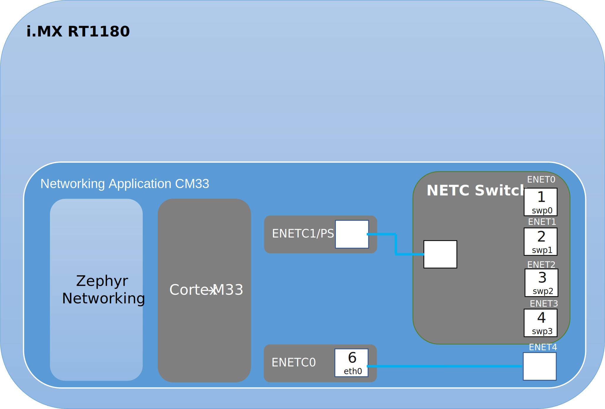

# Networking Application

The application implements the [Zephyr Networking Component](../2_01_application_components/01_zephyr_networking.md) and supports the following platforms and configurations:
- i.MX RT 1180 EVK singlecore (Cortex-M33)

## i.MX RT1180 EVK singlecore  (Cortex-M33)

The following diagram describes the software architecture of the application running on i.MX RT1180 EVK singlecore

<figure>

<figcaption>
Networking Application Software Architecture on i.MX RT1180 EVK
</figcaption>
</figure>

The following table lists the available network interfaces on the i.MX RT1180 EVK:

<table>
<caption>
i.MX RT1180 EVK network interfaces
</caption>
<colgroup>
<col style="width: 25%" />
<col style="width: 35%" />
<col style="width: 40%" />
</colgroup>
<thead>
<tr>
<th style="text-align: center;"><strong>HW Interface</strong></th>
<th style="text-align: center;"><strong>Description</strong></th>
<th style="text-align: center;"><strong>Zephyr Interface Name / Number</strong></th>
</tr>
</thead>
<tbody>
<tr>
<td style="text-align: center;">ENET0 J28</td>
<td style="text-align: center;">External switch port</td>
<td style="text-align: center;">swp0 / 1</td>
</tr>
<tr>
<td style="text-align: center;">ENET1 J29</td>
<td style="text-align: center;">External switch port</td>
<td style="text-align: center;">swp1 / 2</td>
</tr>
<tr>
<td style="text-align: center;">ENET2 J30</td>
<td style="text-align: center;">External switch port</td>
<td style="text-align: center;">swp2 / 3</td>
</tr>
<tr>
<td style="text-align: center;">ENET3 J31</td>
<td style="text-align: center;">External switch port</td>
<td style="text-align: center;">swp3 / 4</td>
</tr>
<tr>
<td style="text-align: center;">ENET4 J32</td>
<td style="text-align: center;">ENETC0 (Endpoint port)</td>
<td style="text-align: center;">eth0 / 6</td>
</tr>
</tbody>
</table>

