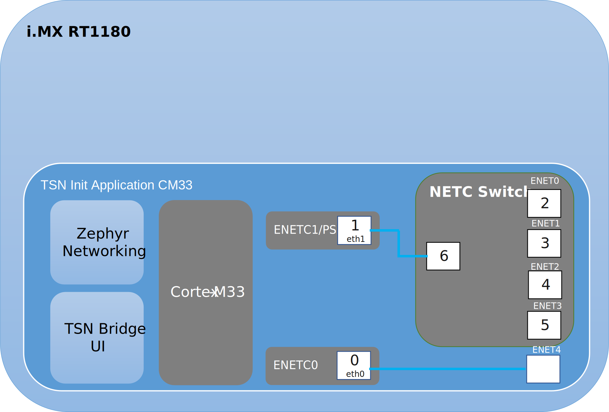
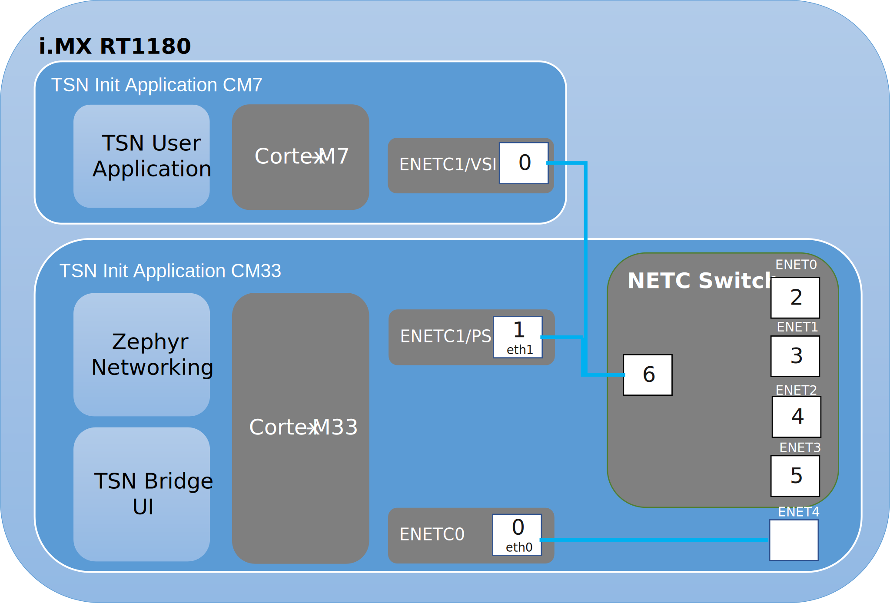

# TSN Bridge Application

The application implements the [TSN bridge](../2_01_application_components/02_tsn_bridge_tsn_init.md) and supports the following platforms and configurations:
- i.MX RT 1180 EVK singlecore (Cortex-M33)
- i.MX RT 1180 EVK multicore  (Cortex-M33 + Cortex-M7)

## i.MX RT1180 EVK singlecore  (Cortex-M33)

The following diagram describes the software architecture of the application running on i.MX RT1180 EVK singlecore

<figure>

<figcaption>
TSN Init Application Software Architecture on i.MX RT1180 EVK (Singlecore)
</figcaption>
</figure>

Cortex-M33 is running the TSN Bridge application described above, which includes:

- one Standalone Endpoint (logical port 0, ENETC0).

- one Endpoint located behind the switch (logical port 1, ENETC1/PSI).

- Two Zephyr network interfaces (eth0 and eth1, interface number 0 and 1), mapped respectively to (logical port 0, ENETC0) and (logical port 1, ENETC1/PSI)

For the i.MX RT1180 EVK, the logical port identifiers are defined as follows for the Cortex-M33 default application:

<table>
<caption>
i.MX RT1180 default ports mapping for Cortex-M33
</caption>
<thead>
<tr>
<th>Logical port number</th>
<th>Description</th>
<th>Physical port on EVK</th>
</tr>
</thead>
<tbody>
<tr><td>0</td><td>Endpoint standalone port</td><td>ENET4</td></tr>
<tr><td>1</td><td>Endpoint port (connected to Bridge 5th port)</td><td>Internal port</td></tr>
<tr><td>2</td><td>Bridge's 1st port</td><td>ENET0</td></tr>
<tr><td>3</td><td>Bridge's 2nd port</td><td>ENET1</td></tr>
<tr><td>4</td><td>Bridge's 3rd port</td><td>ENET2</td></tr>
<tr><td>5</td><td>Bridge's 4th port</td><td>ENET3</td></tr>
<tr><td>6</td><td>Bridge's 5th/host port</td><td>Internal port</td></tr>
</tbody>
</table>

## i.MX RT1180 EVK multicore  (Cortex-M33 + Cortex-M7)

The following diagram describes the software architecture of the application running on i.MX RT1180 EVK multicore application

<figure>

<figcaption>
TSN Init Application Software Architecture on i.MX RT1180 EVK (Multicore)
</figcaption>
</figure>

Cortex-M33 is running the TSN Bridge application described above, which includes:

- one Standalone Endpoint (logical port 0, ENETC0).

- one Endpoint located behind the switch (logical port 1, ENETC1/PSI).

- Two Zephyr network interfaces (eth0 and eth1, interface number 0 and 1), mapped respectively to (logical port 0, ENETC0) and (logical port 1, ENETC1/PSI)

Cortex-M7 is running a lightweight user application that launches the GenAVB/TSN stack and includes:

- one TSN Endpoint network interface (logical port 0, ENETC1/VSI).

Both Endpoints (Cortex-M7 endpoint and Cortex-M33 endpoint), sharing the same “pseudo” port (ENETC1), are connected to an internal bridge port (logical port 6).

> **_NOTE:_** Some restrictions apply to the Cortex-M7 application:
> 
> - Scheduled Traffic configuration is common for both Integrated Endpoints and done using Cortex-M33 serial terminal.

 

For the i.MX RT1180 EVK, the logical port identifiers are defined as follows for the Cortex-M33 default application:

<table>
<caption>
i.MX RT1180 default ports mapping for Cortex-M33
</caption>
<thead>
<tr>
<th>Logical port number</th>
<th>Description</th>
<th>Physical port on EVK</th>
</tr>
</thead>
<tbody>
<tr><td>0</td><td>Endpoint standalone port</td><td>ENET4</td></tr>
<tr><td>1</td><td>Endpoint port (connected to Bridge 5th port)</td><td>Internal port</td></tr>
<tr><td>2</td><td>Bridge's 1st port</td><td>ENET0</td></tr>
<tr><td>3</td><td>Bridge's 2nd port</td><td>ENET1</td></tr>
<tr><td>4</td><td>Bridge's 3rd port</td><td>ENET2</td></tr>
<tr><td>5</td><td>Bridge's 4th port</td><td>ENET3</td></tr>
<tr><td>6</td><td>Bridge's 5th/host port</td><td>Internal port</td></tr>
</tbody>
</table>

For the i.MX RT1180 EVK, the logical port identifiers are defined as follows for the Cortex-M7 default application:

<table>
<caption>
i.MX RT1180 default port mapping for Cortex-M7
</caption>
<thead>
<tr>
<th>Logical port number</th>
<th>Description</th>
<th>Physical port on EVK</th>
</tr>
</thead>
<tbody>
<tr><td>0</td><td>Endpoint port (connected to Bridge 5th port)</td><td>Internal port</td></tr>
</tbody>
</table>

