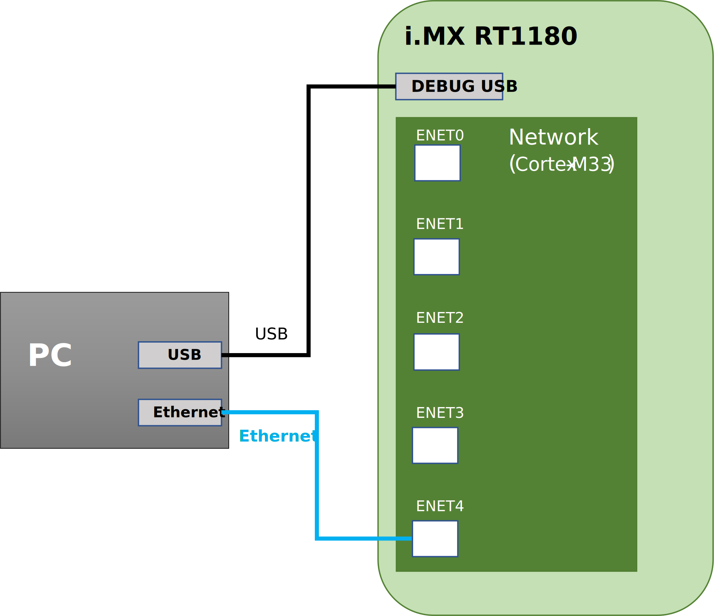

# Networking Application (i.MX RT118x)

This setup demonstrates the networking capabilities of the i.MX RT1180 EVK, using Zephyr's Net Shell and Zperf to perform TCP and UDP throughput measurements between the board and a host PC. The application is described in section [Networking Application](../02_example_applications/2_01_application_components/01_zephyr_networking.md).

The use case is described in [Networking Application - i.MX RT118x](../02_example_applications/2_02_evaluation_applications/01_zephyr_networking_i_mx_rt118x.md).

<div align="center">
<figure>

<figcaption><p>Networking Application with i.MX RT1180 EVK setup (shown with ENET4 / eth0)</p></figcaption>
</figure>
</div>

## Hardware

- An i.MX RT1180 EVK board
- A host PC with iPerf 2.x
- A micro-USB cable for serial communication
- An Ethernet cable

## Evaluation

Plug an Ethernet cable between the host PC and the desired Ethernet port on the i.MX RT1180 EVK, then follow the steps below using the corresponding Zephyr interface number from the table above.

## Configure the network interface

On the board serial terminal, configure the network interface using one of the following options:

**Option 1: Set a static IP address manually**

1. Set the IPv4 address on the interface, replacing `<if_number>` with the Zephyr interface number:

```console
uart:~$ net ipv4 add <if_number> 192.168.10.164 255.255.255.0
```

2. Verify the network interface configuration:

```console
uart:~$ net iface <if_number>
```

**Option 2: Use DHCP**

DHCP is enabled by default on ENETC0 (eth0, interface 6). For switch ports (swp0–swp3), enable it manually:

```console
uart:~$ net dhcpv4 client start <if_number>
```

If a DHCP server is running on the host PC, the following message should appear in the board terminal:

```
[00:00:03.873,000] <inf> net_dhcpv4: Received: 192.168.10.106
```

The assigned IP address can then be confirmed using:

```console
uart:~$ net iface <if_number>
```

## Run TCP/IP networking tests

The following sections describe how to run TCP and UDP throughput tests in both directions. In all examples:

- `<board_ip_address>` is the IP address assigned to the board (e.g. `192.168.10.164`)
- `<host_pc_ip_address>` is the IP address of the host PC (e.g. `192.168.10.5`)
- `<duration>` is the test duration in seconds (e.g. `60`)
- `<packet_size>` is the size of each packet in bytes (e.g. `1460`)

### TCP Upload (board → host PC)

The board acts as a Zperf client sending data to the host PC iPerf server.

1. On the **host PC**, start the iPerf TCP server:

```bash
iperf -s -p 5001 -i 5
```

2. On the **board terminal**, start the Zperf TCP upload:

```console
uart:~$ zperf tcp upload <host_pc_ip_address> 5001 <duration> <packet_size>
```

For example
```console
uart:~$ zperf tcp upload 192.168.10.5 5001 60 2920
```

### TCP Download (host PC → board)

The board acts as a Zperf server receiving data from the host PC iPerf client.

1. On the **board terminal**, start the Zperf TCP server:

```console
uart:~$ zperf tcp download 5001
```

2. On the **host PC**, start the iPerf TCP client:

```bash
iperf -c <board_ip_address> -p 5001 -i 5 -t <duration> -w 2000
```

For example
```bash
iperf -c 192.168.10.164 -i 5 -t 60 -w 2000
```

### UDP Upload (board → host PC)

The board acts as a Zperf client sending UDP datagrams to the host PC iPerf server.

1. On the **host PC**, start the iPerf UDP server:

```bash
iperf -s -u -p 5001 -i 5
```

2. On the **board terminal**, start the Zperf UDP upload, optionally specifying a target rate:

```console
uart:~$ zperf udp upload <host_pc_ip_address> 5001 <duration> <packet_size> <rate>
```

For example
```console
uart:~$ zperf udp upload 192.168.10.5 5001 60 1460 40M
```

### UDP Download (host PC → board)

The board acts as a Zperf server receiving UDP datagrams from the host PC iPerf client.

1. On the **board terminal**, start the Zperf UDP server:

```console
uart:~$ zperf udp download 5001
```

2. On the **host PC**, start the iPerf UDP client:

```bash
iperf -u -c <board_ip_address> -p 5001 -i 5 -t <duration> -l <packet_size> -b <rate>
```

For example
```bash
iperf -u -c 192.168.10.164 -p 5001 -t 60 -i 5 -l 1460 -b 40M
```

For more information on available Zperf commands, refer to the Zephyr documentation or use the built-in help:

```console
uart:~$ zperf --help
```
