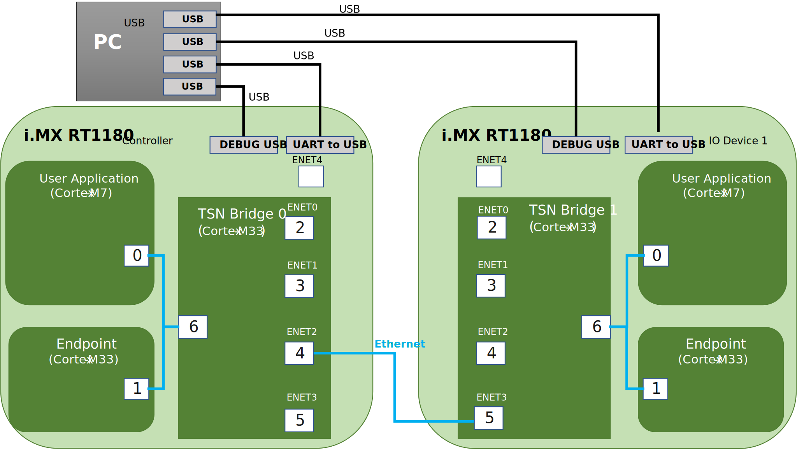

# TSN Bridge Application (i.MX RT118x)

This setup demonstrates the networking capabilities of the i.MX RT1180 EVK, using the GenAVB/TSN Stack. The application is described in section [TSN Bridge Application](../02_example_applications/2_01_application_components/02_tsn_bridge_tsn_init.md).

The use case is described in [TSN Bridge Application - i.MX RT118x](../02_example_applications/2_02_evaluation_applications/02_tsn_bridge_tsn_init_i_mx_rt118x.md) and can be using either singlecore or multicore variant.

## Zephyr Networking Evaluation

<div align="center">
<figure>

<figcaption><p>TSN Init Application with i.MX RT1180 EVK connected to a PC Setup</p></figcaption>
</figure>
</div>

### Hardware

- An i.MX RT1180 EVK board
- A host PC with iPerf 2.x
- A micro-USB cable for serial communication
- An Ethernet cable

### Evaluation

Plug an Ethernet cable between the host PC and the desired Ethernet port on the i.MX RT1180 EVK, then follow the steps below using the corresponding Zephyr interface number from the table above.

### Configure the network interface

On the board serial terminal, configure the network interface using one of the following options:

**Option 1: Set a static IP address on config in persistent storage (Recommended)**

Each of the network interfaces starts with a default configuration. To provide a different static IP address that will be applied at boot time, use the storage commands:

```console
uart:~$ fs echo /lfs/port0/ip_addr "192.168.1.164"
uart:~$ fs echo /lfs/port0/gw_addr "192.168.1.254"
uart:~$ fs echo /lfs/port0/net_mask "255.255.255.0"
```

The assigned IP address can then be confirmed using:

```console
uart:~$ net iface 1
```

**Option 2: Set a static IP address manually using Net Shell**

1. Set the the interface down:

```console
uart:~$ net ipv4 down 1
```

2. Set the IPv4 address on the interface:

To apply a new IPv4 address, the previously configured one needs to be removed first:

```console
uart:~$ net ipv4 del 1 <previous ip address>
uart:~$ net ipv4 add 1 192.168.10.164 255.255.255.0
```

3. Set the the interface up:

```console
uart:~$ net ipv4 up 1
```

4. Verify the network interface configuration:

```console
uart:~$ net iface 1
```

### Run TCP/IP networking tests

Once the network configuration is established for the connected port(s). Networking capabilities are available:
- Net ping with the local PC.
- Run iPerf throughput tests as in networking application [Run TCP/IP networking tests](./01_zephyr_networking_i_mx_rt118x.md#run-tcpip-networking-tests)

## gPTP Evaluation

<div align="center">
<figure>

<figcaption><p>TSN Init Application with two i.MX RT1180 EVK TSN Bridges setup</p></figcaption>
</figure>
</div>

### Hardware

- Two TSN capable Bridges (i.MX RT118x boards)
- Two TSN Endpoints (one per board, running on Cortex-M7)
- A PC with a serial terminal emulator
- USB cables for TSN Endpoints and Bridges
- An Ethernet cable

### Setup preparation

Connect the boards and PC as described in the board-specific sections below.

The use case is described in [TSN Bridge Application - i.MX RT118x](../02_example_applications/2_02_evaluation_applications/02_tsn_bridge_tsn_init_i_mx_rt118x.md).

### Two i.MX RT1180 EVKs

1. Connect an Ethernet cable between ENET2 (port 4) of the **TSN Bridge 0** and ENET3 (port 5) of the **TSN Bridge 1**.
2. Connect a USB cable between the **UART-to-USB** port of each **TSN Endpoint** board and the PC.
3. Connect a USB cable between the **DEBUG USB** port of each **TSN Bridge** board and the PC.
4. Open a serial terminal on the PC for each **TSN Endpoint** and each **TSN Bridge** USB port.
5. Make sure the image is flashed on each board.

#### TSN Bridge 0

Check section [TSN Network Configuration](../04_more_on_evaluation_usage/06_tsn_network_configuration.md#tsn-network-configuration) for network configuration.

#### TSN Bridge 1

Check section [TSN Network Configuration](../04_more_on_evaluation_usage/06_tsn_network_configuration.md#tsn-network-configuration) for network configuration.

As both devices have the same default Hardware Address (see section [Hardware Address](../04_more_on_evaluation_usage/03_common_configuration.md#hardware-address)), change the Hardware Address of the Bridge to avoid conflicts:

```console
uart:~$ fs cd /lfs
uart:~$ fs mkdir port0
uart:~$ fs mkdir port1
uart:~$ fs mkdir port2
uart:~$ fs mkdir port3
uart:~$ fs mkdir port4
uart:~$ fs mkdir port5
uart:~$ fs mkdir port6

uart:~$ fs echo port0/hw_addr 00:aa:bb:dd:02:00
uart:~$ fs echo port1/hw_addr 00:aa:bb:dd:02:01
uart:~$ fs echo port2/hw_addr 00:aa:bb:dd:02:02
uart:~$ fs echo port3/hw_addr 00:aa:bb:dd:02:03
uart:~$ fs echo port4/hw_addr 00:aa:bb:dd:02:04
uart:~$ fs echo port5/hw_addr 00:aa:bb:dd:02:05
uart:~$ fs echo port6/hw_addr 00:aa:bb:dd:02:06
```

### Evaluation instructions

Reset all endpoints. After a few seconds, the **TSN Bridges** should be synchronized through gPTP. Check the logs as described below.

### Two i.MX RT1180 EVKs

The **TSN Bridge** acting as grand master should show role "Master" in its logs:

```
Port(X): domain(0, 0): Role: Master   Link: Up  asCapable: Yes neighborGptpCapable: Yes delayMechanism: P2P
```

The other one should show role "Slave" as follows:

```
Port(X): domain(0, 0): Role: Slave   Link: Up  asCapable: Yes neighborGptpCapable: Yes delayMechanism: P2P
```

For more information concerning serial terminal logs please refer to section [GenAVB/TSN Stack Logs](../04_more_on_evaluation_usage/08_genavb_tsn_stack_logs.md#genavbtsn-stack-logs) and section [TSN Application Logs](../04_more_on_evaluation_usage/09_example_applications_logs.md#tsn-application-logs).

