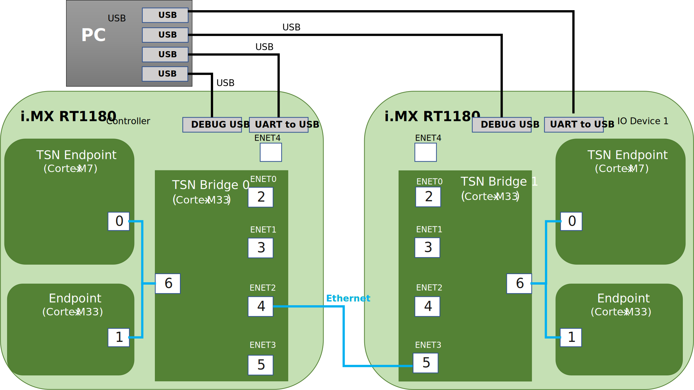

# TSN Network only with two TSN Bridges

This setup is demonstrating multiple TSN Endpoints connected through two TSN Bridges running the TSN isochronous application described in section [TSN Isochronous Application](../02_example_applications/2_01_application_components/03_tsn_app.md). One instance of the TSN Endpoint application is running on each i.MX RT1180 board.

The use case is described in [TSN Isochronous Application - i.MX RT118x](../02_example_applications/2_02_evaluation_applications/03_tsn_app_i_mx_rt118x.md) and uses the **multicore** variant.

## Requirements

- Two TSN capable Bridges (i.MX RT118x boards)
- Two TSN Endpoints (one per board, running on Cortex-M7)
- A PC with a serial terminal emulator
- USB cables for TSN Endpoints and Bridges
- An Ethernet cable

## Setup preparation

Connect the boards and PC as described in the board-specific sections below.

## Two i.MX RT1180 EVKs

<div align="center">
<figure>

<figcaption><p>TSN Network only with two i.MX RT1180 EVK TSN Bridges setup</p></figcaption>
</figure>
</div>

1. Connect an Ethernet cable between ENET2 (port 4) of the **TSN Bridge 0** and ENET3 (port 5) of the **TSN Bridge 1**.
2. Connect a USB cable between the **UART-to-USB** port of each **TSN Endpoint** board and the PC.
3. Connect a USB cable between the **DEBUG USB** port of each **TSN Bridge** board and the PC.
4. Open a serial terminal on the PC for each **TSN Endpoint** and each **TSN Bridge** USB port.
5. Make sure the image is flashed on each board.

### TSN Bridge 0

Check section [TSN Network Configuration](../04_more_on_evaluation_usage/06_tsn_network_configuration.md#tsn-network-configuration) for network configuration.

#### VLAN and FDB entries settings

Using the serial terminal, access the **TSN Bridge 0** shell, see [Using the Built-in Shell](../04_more_on_evaluation_usage/01_using_the_built_in_shell.md#using-the-built-in-shell).

Create VLAN entries for logical ports 4 and 6 (mapped respectively to Bridge ports ENET2 and Internal) as follows (see section [VLAN Registration Configuration](../04_more_on_evaluation_usage/05_bridge_configuration_i_mx_rt118x.md#vlan-registration-configuration) and [Streams](../04_more_on_evaluation_usage/06_tsn_network_configuration.md#streams)):

```console
uart:~$ net genavb vlan update 2 4 -c 1 -p
uart:~$ net genavb vlan update 2 6 -c 1 -p
```

Create FDB entries for logical ports 4 and 6 as follows (see section [FDB Configuration](../04_more_on_evaluation_usage/05_bridge_configuration_i_mx_rt118x.md#fdb-configuration) and [Streams](../04_more_on_evaluation_usage/06_tsn_network_configuration.md#streams)):

```console
uart:~$ net genavb fdb update 91:e0:f0:00:fe:70 2 4 -c 1 -p
uart:~$ net genavb fdb update 91:e0:f0:00:fe:71 2 6 -c 1 -p
```

#### Scheduled Traffic settings

Using the serial terminal, access the **TSN Bridge 0** shell, see [Using the Built-in Shell](../04_more_on_evaluation_usage/01_using_the_built_in_shell.md#using-the-built-in-shell).

Create Scheduled Traffic entries for Bridge ports mapped to logical ports 4 and 6 as follows (see section [Scheduled Traffic (Qbv) Configuration](../04_more_on_evaluation_usage/03_common_configuration.md#scheduled-traffic-qbv-configuration)):

```console
uart:~$ net genavb qbv set 4 -b 35000 -c 100000 -C 0 -l 08,10000 -l f7,90000 -p
applying st configuration:

port_id        4
enable         1
base_time      35000 (ns)
cycle_time     100000 (ns)
cycle_time_ext 0 (ns)
list_length    2

gate list:
 entry | oper | gate | interval (ns) |
-------+------+------+---------------+
     0 | 0x00 | 0x08 |         10000 |
     1 | 0x00 | 0xf7 |         90000 |

scheduled traffic config enabled
```

```console
uart:~$ net genavb qbv set 6 -b 85000 -c 100000 -C 0 -l 08,10000 -l f7,90000 -p
applying st configuration:

port_id        6
enable         1
base_time      85000 (ns)
cycle_time     100000 (ns)
cycle_time_ext 0 (ns)
list_length    2

gate list:
 entry | oper | gate | interval (ns) |
-------+------+------+---------------+
     0 | 0x00 | 0x08 |         10000 |
     1 | 0x00 | 0xf7 |         90000 |

scheduled traffic config enabled
```

### Controller Endpoint

Configure the **TSN Endpoint** on the Controller board (Cortex-M7) as controller by entering the following commands using the TSN Bridge 0 shell (running on the Cortex-M33):

```console
uart:~$ fs cd /lfs
uart:~$ fs mkdir m7
uart:~$ fs mkdir m7/tsn_app
uart:~$ fs echo m7/tsn_app/role 0
uart:~$ fs echo m7/tsn_app/mode 2
uart:~$ fs echo m7/tsn_app/num_io_devices 1
```

#### Scheduled Traffic settings

Enable Scheduled Traffic on the **TSN Endpoint** (Cortex-M7, port 1) via the **TSN Bridge 0** shell:

```console
uart:~$ net genavb qbv set 1 -b 35000 -c 100000 -C 0 -l 02,5000 -l fd,95000 -p
applying st configuration:

port_id        1
enable         1
base_time      35000 (ns)
cycle_time     100000 (ns)
cycle_time_ext 0 (ns)
list_length    2

gate list:
 entry | oper | gate | interval (ns) |
-------+------+------+---------------+
     0 | 0x00 | 0x02 |          5000 |
     1 | 0x00 | 0xfd |         95000 |

scheduled traffic config enabled
```

### TSN Bridge 1

Check section [TSN Network Configuration](../04_more_on_evaluation_usage/06_tsn_network_configuration.md#tsn-network-configuration) for network configuration.

As both devices have the same default Hardware Address (see section [Hardware Address](../04_more_on_evaluation_usage/03_common_configuration.md#hardware-address)), change the Hardware Address of the Bridge to avoid conflicts:

```console
uart:~$ fs cd /lfs
uart:~$ fs mkdir port0
uart:~$ fs mkdir port1
uart:~$ fs mkdir port2
uart:~$ fs mkdir port3
uart:~$ fs mkdir port4
uart:~$ fs mkdir port5
uart:~$ fs mkdir port6

uart:~$ fs echo port0/hw_addr 00:aa:bb:dd:02:00
uart:~$ fs echo port1/hw_addr 00:aa:bb:dd:02:01
uart:~$ fs echo port2/hw_addr 00:aa:bb:dd:02:02
uart:~$ fs echo port3/hw_addr 00:aa:bb:dd:02:03
uart:~$ fs echo port4/hw_addr 00:aa:bb:dd:02:04
uart:~$ fs echo port5/hw_addr 00:aa:bb:dd:02:05
uart:~$ fs echo port6/hw_addr 00:aa:bb:dd:02:06
```

#### VLAN and FDB entries settings

Using the serial terminal, access the **TSN Bridge 1** shell, see [Using the Built-in Shell](../04_more_on_evaluation_usage/01_using_the_built_in_shell.md#using-the-built-in-shell).

Create VLAN entries for logical ports 5 and 6 (mapped respectively to Bridge ports ENET3 and Internal) as follows (see section [VLAN Registration Configuration](../04_more_on_evaluation_usage/05_bridge_configuration_i_mx_rt118x.md#vlan-registration-configuration) and [Streams](../04_more_on_evaluation_usage/06_tsn_network_configuration.md#streams)):

```console
uart:~$ net genavb vlan update 2 5 -c 1 -p
uart:~$ net genavb vlan update 2 6 -c 1 -p
```

Create FDB entries for logical ports 5 and 6 as follows (see section [FDB Configuration](../04_more_on_evaluation_usage/05_bridge_configuration_i_mx_rt118x.md#fdb-configuration) and [Streams](../04_more_on_evaluation_usage/06_tsn_network_configuration.md#streams)):

```console
uart:~$ net genavb fdb update 91:e0:f0:00:fe:70 2 6 -c 1 -p
uart:~$ net genavb fdb update 91:e0:f0:00:fe:71 2 5 -c 1 -p
```

#### Scheduled Traffic settings

Using the serial terminal, access the **TSN Bridge 1** shell, see [Using the Built-in Shell](../04_more_on_evaluation_usage/01_using_the_built_in_shell.md#using-the-built-in-shell).

Create Scheduled Traffic entries for Bridge ports mapped to logical ports 5 and 6 as follows (see section [Scheduled Traffic (Qbv) Configuration](../04_more_on_evaluation_usage/03_common_configuration.md#scheduled-traffic-qbv-configuration)):

```console
uart:~$ net genavb qbv set 6 -b 35000 -c 100000 -C 0 -l 08,10000 -l f7,90000 -p
applying st configuration:

port_id        6
enable         1
base_time      35000 (ns)
cycle_time     100000 (ns)
cycle_time_ext 0 (ns)
list_length    2

gate list:
 entry | oper | gate | interval (ns) |
-------+------+------+---------------+
     0 | 0x00 | 0x08 |         10000 |
     1 | 0x00 | 0xf7 |         90000 |

scheduled traffic config enabled
```

```console
uart:~$ net genavb qbv set 5 -b 85000 -c 100000 -C 0 -l 08,10000 -l f7,90000 -p
applying st configuration:

port_id        5
enable         1
base_time      85000 (ns)
cycle_time     100000 (ns)
cycle_time_ext 0 (ns)
list_length    2

gate list:
 entry | oper | gate | interval (ns) |
-------+------+------+---------------+
     0 | 0x00 | 0x08 |         10000 |
     1 | 0x00 | 0xf7 |         90000 |

scheduled traffic config enabled
```

### IO Device Endpoint

Configure the **TSN Endpoint** on the IO Device board (Cortex-M7) as IO device by entering the following commands using the TSN Bridge 1 shell (running on the Cortex-M33):

```console
uart:~$ fs cd /lfs
uart:~$ fs mkdir m7
uart:~$ fs mkdir m7/tsn_app
uart:~$ fs echo m7/tsn_app/role 1
uart:~$ fs echo m7/tsn_app/mode 2
```

As both devices have the same default Hardware Address (see section [Hardware Address](../04_more_on_evaluation_usage/03_common_configuration.md#hardware-address)), change the Hardware Address of the IO Device Endpoint to avoid conflicts:

```console
uart:~$ fs cd /lfs
uart:~$ fs mkdir m7/port0
uart:~$ fs echo m7/port0/hw_addr 00:bb:cc:dd:04:10
```

#### Scheduled Traffic settings

Enable Scheduled Traffic on the **TSN Endpoint** (Cortex-M7, port 1) via the **TSN Bridge 1** shell:

```console
uart:~$ net genavb qbv set 1 -b 85000 -c 100000 -C 0 -l 08,10000 -l f7,90000 -p
applying st configuration:

port_id        1
enable         1
base_time      85000 (ns)
cycle_time     100000 (ns)
cycle_time_ext 0 (ns)
list_length    2

gate list:
 entry | oper | gate | interval (ns) |
-------+------+------+---------------+
     0 | 0x00 | 0x08 |         10000 |
     1 | 0x00 | 0xf7 |         90000 |

scheduled traffic config enabled
```

## Evaluation instructions

Reset all endpoints. After a few seconds, the **TSN Bridges** should be synchronized through gPTP and **TSN endpoints** exchanging packets at the rate of 10000 packets per second (pps). Check the logs as described below.

## Two i.MX RT1180 EVKs

The **TSN Bridge** acting as grand master should show role "Master" in its logs:

```
fgptp fgptp_stats_dump: Port 1 : Role: Master Link : Up AS_Capable: Yes
fgptp fgptp_stats_dump: Port 2 : Role: Master Link : Up AS_Capable: Yes
```

If a **TSN Endpoint** has gPTP running correctly:

```
fgptp fgptp_stats_dump: Port 0 : Role: Slave Link : Up AS_Capable: Yes
```

If the application socket is correctly receiving packets, "link up" should be shown on all Endpoints:

```
socket_stats_print : link up
```

Between two appearances of the following log, the number XXXXX should increment by 50000 (10000 pps for 5 seconds):

```
socket_stats_print : valid frames : XXXXX
```

### Scheduled Traffic evaluation

### Controller Endpoint

Observe traffic latency stats on the **Controller TSN Endpoint** serial terminal:

```
stats(0x2000f558) traffic latency min 37319 mean 37332 max 37344 rms^2 1393712523 stddev^2 24 absmin 37312 absmax 38045
```

- Latency is around 37.5μs (time offset at which the time sensitive traffic gate opens plus transit time)
- Latency jitter is around few hundreds ns (much smaller than the 12.3μs required to transmit a MTU size frame at 1Gbps)

### IO Device Endpoint

Observe traffic latency stats on the **IO Device TSN Endpoint** serial terminal:

```
stats(0x2000f558) traffic latency min 37323 mean 37335 max 37347 rms^2 1393948985 stddev^2 15 absmin 37308 absmax 37354
```

- Latency is around 37.5μs (time offset at which the time sensitive traffic gate opens plus transit time)
- Latency jitter is around few hundreds nanoseconds

For more information concerning serial terminal logs please refer to section [GenAVB/TSN Stack Logs](../04_more_on_evaluation_usage/08_genavb_tsn_stack_logs.md#genavbtsn-stack-logs) and section [TSN Application Logs](../04_more_on_evaluation_usage/09_example_applications_logs.md#tsn-application-logs).
