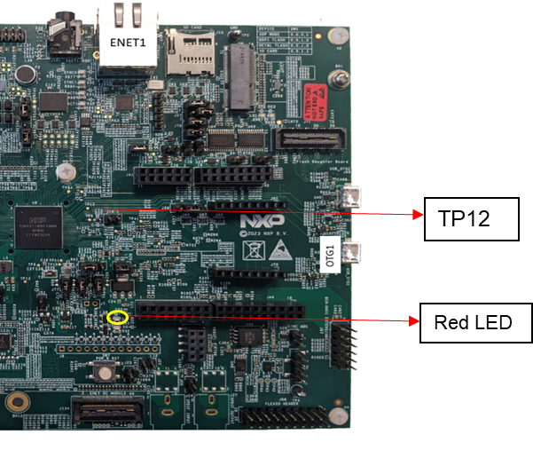

# Pulse Per Second (PPS) signal

*Note: This feature is only available on i.MX RT1180 boards. For better observation of PPS signal using oscilloscope, set the time scale (x-axis) to 20ns and the voltage scale (y-axis) to 1V.*

The PPS signal pulse occurs at each integer second of gPTP time. This can be used to measure the time synchronization accuracy against another time aware system or for synchronization purpose.

## i.MX RT1180 EVK

The PPS signal is currently supported on the Cortex-M33 on the i.MX RT1180. This PPS signal is generated using fiper (fixed period) pulse.

The PPS signal can be observed visually using a red LED (Diode D7) called USER LED2. This USER LED 2 is connected to pad GPIO_AD_26 on the i.MX RT1180. The red LED blinks at each integer second of gPTP time.

The same PPS signal can also be observed using an oscilloscope by connecting a probe to test point TP12. This test point is connected to pad GPIO_SD_B2_04 on the i.MX RT1180. The PPS signal with

~2V peak voltage and ~3 ms pulse width can be observed using oscilloscope.

<figure>

<figcaption>
1PPS signal on i.MX RT1180 EVK
</figcaption>
</figure>

